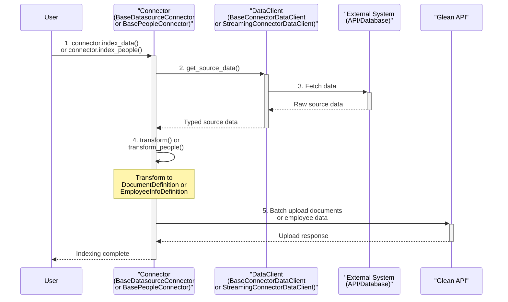

# Glean Indexing SDK

A Python SDK for building custom Glean indexing integrations. This package provides the base classes and utilities to create custom connectors for Glean's indexing APIs.

## Installation

```bash
# Using pip
pip install glean-indexing-sdk

# Using uv
uv add glean-indexing-sdk
```

## Architecture Overview

The Glean Indexing SDK follows a simple, predictable pattern for all connector types. Understanding this flow will help you implement any connector quickly:



**Key Components:**

1. **DataClient** - Fetches raw data from your external system (API, database, files, etc.)
2. **Connector** - Transforms your data into Glean's format and handles the upload process

---

## Datasource Connectors

Use datasource connectors to index documents, files, and content from external systems into Glean. This is the most common use case.

## Datasource Quickstart

### Environment Setup

1. Set up environment variables for Glean API access:

    ```bash
    # Copy the environment template
    cp env.template .env

    # Set your Glean credentials
    export GLEAN_INSTANCE="acme"
    export GLEAN_INDEXING_API_TOKEN="your-indexing-api-token"
    ```

> [!TIP] Choose the right connector type:
>
> **BaseDatasourceConnector** - For most use cases (< 50k documents)
> **BaseStreamingDatasourceConnector** - For large datasets (memory efficient)
> **Single Document Indexing** - For real-time updates of individual documents

## BaseDatasourceConnector

### When to Use This

#### Perfect for

- Document repositories with < 50,000 documents
- Wikis, knowledge bases, documentation sites
- File systems with moderate amounts of content
- Systems where you can fetch all data in memory at once

#### Avoid when

- You have millions of documents
- Documents are very large (> 10MB each)
- Memory usage is a concern

### Step-by-Step Implementation

#### Step 1: Define Your Data Type

```python
from typing import List, TypedDict

class WikiPageData(TypedDict):
    """Type definition for your source data structure."""
    id: str
    title: str
    content: str
    author: str
    created_at: str
    updated_at: str
    url: str
    tags: List[str]
```

#### Step 2: Create Your DataClient

```python
from typing import Sequence
from glean.indexing.connectors.base_data_client import BaseConnectorDataClient

class WikiDataClient(BaseConnectorDataClient[WikiPageData]):
    """Fetches data from your external system."""
    
    def __init__(self, wiki_base_url: str, api_token: str):
        self.wiki_base_url = wiki_base_url
        self.api_token = api_token
    
    def get_source_data(self, since=None) -> Sequence[WikiPageData]:
        """Fetch all your documents here."""
        # Your implementation here - call APIs, read files, query databases
        pass
```

#### Step 3: Create Your Connector

```python
from typing import List, Sequence
from glean.indexing.models import DocumentDefinition, ContentDefinition
from glean.indexing.connectors import BaseDatasourceConnector
from glean.indexing.utils.models import DatasourceConfig

class CompanyWikiConnector(BaseDatasourceConnector[WikiPageData]):
    """Transform and upload your data to Glean."""
    
    configuration: DatasourceConfig = {
        "url_regex": r"https://wiki\.company\.com/.*",
        "trust_url_regex_for_view_activity": True,
        "is_user_referenced_by_email": True
    }
    
    def transform(self, data: Sequence[WikiPageData]) -> List[DocumentDefinition]:
        """Transform your data to Glean's format."""
        documents = []
        
        for page in data:
            document = DocumentDefinition(
                id=page["id"],
                title=page["title"],
                datasource=self.name,
                view_url=page["url"],
                body=ContentDefinition(
                    mime_type="text/plain",
                    text_content=page["content"]
                ),
                author_email=page["author"],
                created_at=self._parse_timestamp(page["created_at"]),
                updated_at=self._parse_timestamp(page["updated_at"])
            )
            documents.append(document)
            
        return documents
    
    def _parse_timestamp(self, timestamp_str: str) -> int:
        """Convert ISO timestamp to Unix epoch seconds."""
        from datetime import datetime
        dt = datetime.fromisoformat(timestamp_str.replace('Z', '+00:00'))
        return int(dt.timestamp())
```

#### Step 4: Run the Connector

```python
from glean.indexing.utils.models import IndexingMode

# Initialize
data_client = WikiDataClient(
    wiki_base_url="https://wiki.company.com",
    api_token="your-wiki-token"
)
connector = CompanyWikiConnector(name="company_wiki", data_client=data_client)

# Configure the datasource in Glean
connector.configure_datasource()

# Index all documents
connector.index_data(mode=IndexingMode.FULL)
```

### Complete Example

```python
class WikiPageData(TypedDict):
    """Type definition for wiki page data."""
    id: str
    title: str
    content: str
    author: str
    created_at: str
    updated_at: str
    url: str
    tags: List[str]


class WikiDataClient(BaseConnectorDataClient[WikiPageData]):
    """Data client for a company wiki system."""
    
    def __init__(self, wiki_base_url: str, api_token: str):
        self.wiki_base_url = wiki_base_url
        self.api_token = api_token
    
    def get_source_data(self, since=None) -> Sequence[WikiPageData]:
        pages: List[WikiPageData] = [
            WikiPageData({
                "id": "page_123",
                "title": "Engineering Onboarding Guide", 
                "content": "Welcome to the engineering team...",
                "author": "jane.smith@company.com",
                "created_at": "2024-01-15T10:00:00Z",
                "updated_at": "2024-02-01T14:30:00Z",
                "url": f"{self.wiki_base_url}/pages/123",
                "tags": ["onboarding", "engineering"]
            }),
            WikiPageData({
                "id": "page_124",
                "title": "API Documentation Standards",
                "content": "Our standards for API documentation...", 
                "author": "john.doe@company.com",
                "created_at": "2024-01-20T09:15:00Z",
                "updated_at": "2024-01-25T16:45:00Z", 
                "url": f"{self.wiki_base_url}/pages/124",
                "tags": ["api", "documentation", "standards"]
            })
        ]
        
        if since:
            return [page for page in pages if page["updated_at"] > since]
            
        return pages


class CompanyWikiConnector(BaseDatasourceConnector[WikiPageData]):
    """Connector for indexing company wiki pages."""
    
    configuration: DatasourceConfig = {
        "url_regex": r"https://wiki\.company\.com/.*",
        "trust_url_regex_for_view_activity": True,
        "is_user_referenced_by_email": True
    }
    
    def transform(self, data: Sequence[WikiPageData]) -> List[DocumentDefinition]:
        """Transform wiki pages to Glean document format."""
        documents = []
        
        for page in data:
            document = DocumentDefinition(
                id=page["id"],
                title=page["title"],
                datasource=self.name,
                view_url=page["url"], 
                body=ContentDefinition(
                    mime_type="text/plain",
                    text_content=page["content"]
                ),
                author_email=page["author"],
                created_at=self._parse_timestamp(page["created_at"]),
                updated_at=self._parse_timestamp(page["updated_at"])
            )
            
            documents.append(document)
            
        return documents
    
    def _parse_timestamp(self, timestamp_str: str) -> int:
        """Convert ISO timestamp to Unix epoch seconds."""
        from datetime import datetime
        dt = datetime.fromisoformat(timestamp_str.replace('Z', '+00:00'))
        return int(dt.timestamp())


# Usage
data_client = WikiDataClient(
    wiki_base_url="https://wiki.company.com",
    api_token="your-wiki-token"
)
connector = CompanyWikiConnector(name="company_wiki", data_client=data_client)

connector.configure_datasource()
connector.index_data(mode=IndexingMode.FULL)
```

## BaseStreamingDatasourceConnector

### When to Use This

#### Perfect for

- Large document repositories (50k+ documents)
- Memory-constrained environments  
- Documents that are fetched via paginated APIs
- Very large individual documents (> 10MB)
- When you want to process data incrementally

#### Avoid when

- You have a small document set (< 10k documents)
- Your API can return all data efficiently in one call
- Memory usage is not a concern

### Step-by-Step Implementation

#### Step 1: Define Your Data Type

```python
from typing import TypedDict

class ArticleData(TypedDict):
    """Type definition for knowledge base article data."""
    id: str
    title: str
    content: str
    author_email: str
    updated_at: str
    url: str
```

#### Step 2: Create Your Streaming DataClient

```python
import requests
from typing import Generator
from glean.indexing.connectors.base_streaming_data_client import StreamingConnectorDataClient

class LargeKnowledgeBaseClient(StreamingConnectorDataClient[ArticleData]):
    """Streaming client that yields data incrementally."""
    
    def __init__(self, kb_api_url: str, api_key: str):
        self.kb_api_url = kb_api_url
        self.api_key = api_key
    
    def get_source_data(self, since=None) -> Generator[ArticleData, None, None]:
        """Stream documents one page at a time to save memory."""
        page = 1
        page_size = 100
        
        while True:
            params = {"page": page, "size": page_size}
            if since:
                params["modified_since"] = since
                
            response = requests.get(
                f"{self.kb_api_url}/articles",
                headers={"Authorization": f"Bearer {self.api_key}"},
                params=params
            )
            response.raise_for_status()
            
            data = response.json()
            articles = data.get("articles", [])
            
            if not articles:
                break
                
            for article in articles:
                yield ArticleData(article)
                
            if len(articles) < page_size:
                break
                
            page += 1
```

#### Step 3: Create Your Streaming Connector

```python
from typing import List, Sequence
from glean.indexing.models import DocumentDefinition, ContentDefinition
from glean.indexing.connectors import BaseStreamingDatasourceConnector
from glean.indexing.utils.models import DatasourceConfig

class KnowledgeBaseConnector(BaseStreamingDatasourceConnector[ArticleData]):
    """Memory-efficient connector for large knowledge bases."""
    
    configuration: DatasourceConfig = {
        "url_regex": r"https://kb\.company\.com/.*",
        "trust_url_regex_for_view_activity": True
    }
    
    def __init__(self, name: str, data_client: StreamingConnectorDataClient[ArticleData]):
        super().__init__(name, data_client)
        self.batch_size = 50
    
    def transform(self, data: Sequence[ArticleData]) -> List[DocumentDefinition]:
        """Transform articles to Glean documents."""
        documents = []
        
        for article in data:
            document = DocumentDefinition(
                id=article["id"],
                title=article["title"],
                datasource=self.name,
                view_url=article["url"],
                body=ContentDefinition(
                    mime_type="text/html", 
                    text_content=article["content"]
                ),
                author_email=article.get("author_email"),
                updated_at=self._parse_timestamp(article["updated_at"])
            )
            documents.append(document)
            
        return documents
    
    def _parse_timestamp(self, timestamp_str: str) -> int:
        from datetime import datetime
        dt = datetime.fromisoformat(timestamp_str.replace('Z', '+00:00'))
        return int(dt.timestamp())
```

#### Step 4: Run the Connector

```python
from glean.indexing.utils.models import IndexingMode

data_client = LargeKnowledgeBaseClient(
    kb_api_url="https://kb-api.company.com",
    api_key="your-kb-api-key"
)
connector = KnowledgeBaseConnector(name="knowledge_base", data_client=data_client)

connector.configure_datasource()
connector.index_data(mode=IndexingMode.FULL)
```

### Complete Example

```python
import requests
from typing import Generator, List, Sequence, TypedDict
from glean.indexing.models import DocumentDefinition, ContentDefinition
from glean.indexing.connectors import BaseStreamingDatasourceConnector
from glean.indexing.connectors.base_streaming_data_client import StreamingConnectorDataClient
from glean.indexing.utils.models import IndexingMode, DatasourceConfig


class ArticleData(TypedDict):
    """Type definition for knowledge base article data."""
    id: str
    title: str
    content: str
    author_email: str
    updated_at: str
    url: str


class LargeKnowledgeBaseClient(StreamingConnectorDataClient[ArticleData]):
    """Streaming client for large knowledge base."""
    
    def __init__(self, kb_api_url: str, api_key: str):
        self.kb_api_url = kb_api_url
        self.api_key = api_key
    
    def get_source_data(self, since=None) -> Generator[ArticleData, None, None]:
        """Stream documents one page at a time."""
        page = 1
        page_size = 100
        
        while True:
            params = {"page": page, "size": page_size}
            if since:
                params["modified_since"] = since
                
            response = requests.get(
                f"{self.kb_api_url}/articles",
                headers={"Authorization": f"Bearer {self.api_key}"},
                params=params
            )
            response.raise_for_status()
            
            data = response.json()
            articles = data.get("articles", [])
            
            if not articles:
                break
                
            for article in articles:
                yield ArticleData(article)
                
            if len(articles) < page_size:
                break
                
            page += 1


class KnowledgeBaseConnector(BaseStreamingDatasourceConnector[ArticleData]):
    """Streaming connector for large knowledge base."""
    
    configuration: DatasourceConfig = {
        "url_regex": r"https://kb\.company\.com/.*",
        "trust_url_regex_for_view_activity": True
    }
    
    def __init__(self, name: str, data_client: StreamingConnectorDataClient[ArticleData]):
        super().__init__(name, data_client)
        self.batch_size = 50
    
    def transform(self, data: Sequence[ArticleData]) -> List[DocumentDefinition]:
        """Transform knowledge base articles to documents."""
        documents = []
        
        for article in data:
            document = DocumentDefinition(
                id=article["id"],
                title=article["title"],
                datasource=self.name,
                view_url=article["url"],
                body=ContentDefinition(
                    mime_type="text/html", 
                    text_content=article["content"]
                ),
                author_email=article.get("author_email"),
                updated_at=self._parse_timestamp(article["updated_at"])
            )
            
            documents.append(document)
            
        return documents
    
    def _parse_timestamp(self, timestamp_str: str) -> int:
        """Convert ISO timestamp to Unix epoch seconds."""
        from datetime import datetime
        dt = datetime.fromisoformat(timestamp_str.replace('Z', '+00:00'))
        return int(dt.timestamp())


data_client = LargeKnowledgeBaseClient(
    kb_api_url="https://kb-api.company.com",
    api_key="your-kb-api-key"
)
connector = KnowledgeBaseConnector(name="knowledge_base", data_client=data_client)

connector.configure_datasource()
connector.index_data(mode=IndexingMode.FULL)
```
