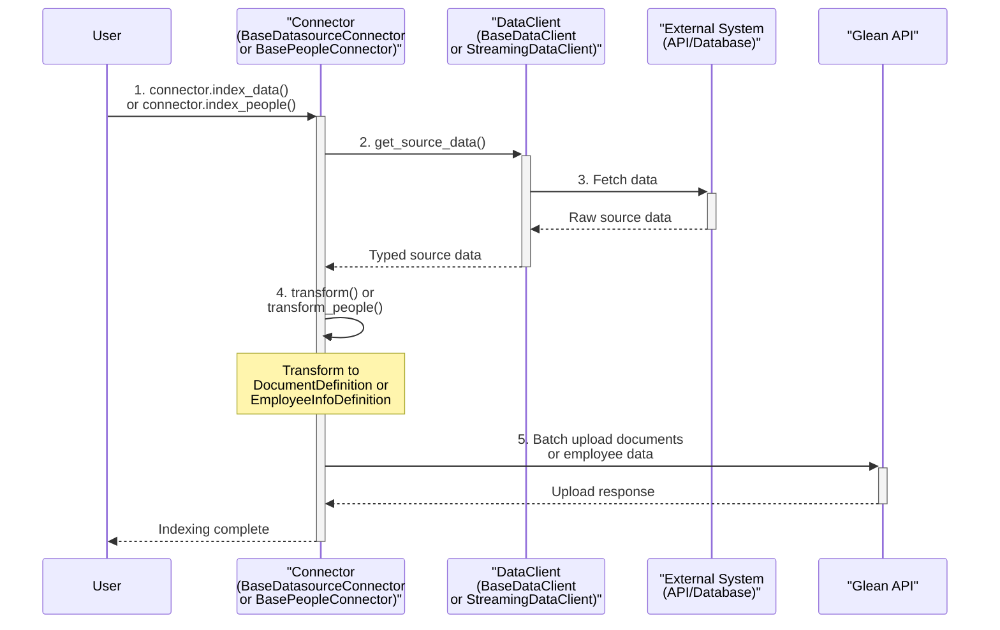

# Architecture Overview

The Glean Indexing SDK follows a simple, predictable pattern for all connector types. Understanding this flow will help you implement any connector quickly.

## Data Flow



## Key Components

1. **DataClient** — Fetches raw data from your external system (API, database, files, etc.)
2. **Connector** — Transforms your data into Glean's format and handles the upload process

## Connector Hierarchy

```
BaseConnector (abstract)
├── BaseDatasourceConnector[T]          — documents that fit in memory
│   ├── BaseStreamingDatasourceConnector[T]      — large/paginated datasets (sync generator)
│   └── BaseAsyncStreamingDatasourceConnector[T]  — large datasets with async I/O
└── BasePeopleConnector                 — employee/identity indexing
```

## Data Client Hierarchy

```
BaseDataClient[T]                — fetches all data at once, returns Sequence[T]
BaseStreamingDataClient[T]       — yields data incrementally via Generator[T]
BaseAsyncStreamingDataClient[T]  — yields data incrementally via AsyncGenerator[T]
```

## Implementation Pattern

Every connector follows the same four steps:

1. **Define your data type** — a `TypedDict` describing your source data
2. **Create a data client** — extends the appropriate `BaseDataClient` variant to fetch from your source
3. **Create a connector** — extends the appropriate `BaseDatasourceConnector` variant, sets `configuration`, and implements `transform()`
4. **Run it** — call `index_data()` (or `index_data_async()` for async connectors)

See the [Quickstart](../README.md) for a complete working example.
